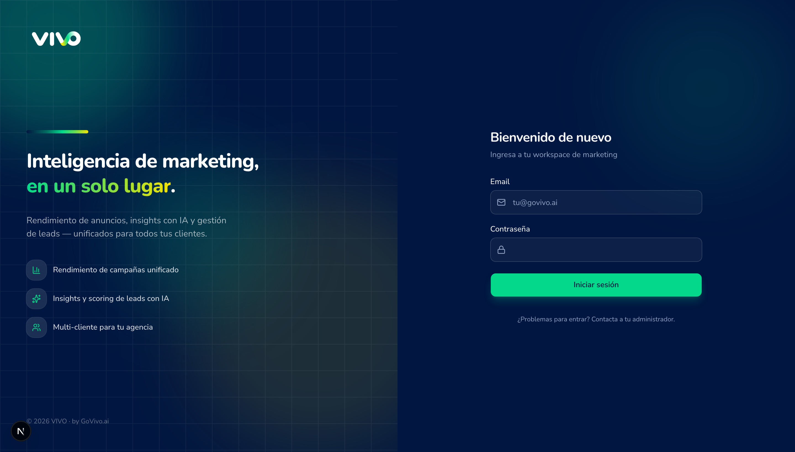
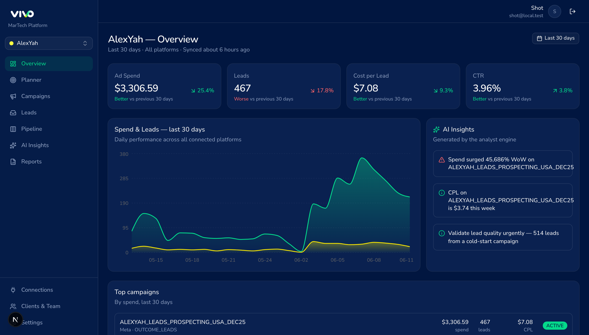

<div align="center">

# ◢ Vivo Marketing OS

### Multi-client marketing intelligence — ad performance, leads, AI insights & campaign planning in one place.

**Crafted by [VictorSandovalDev](https://github.com/VictorSandovalDev)**

<br/>

[](https://nextjs.org/)
[](https://react.dev/)
[](https://www.typescriptlang.org/)
[](https://tailwindcss.com/)

[](https://www.postgresql.org/)
[](https://orm.drizzle.team/)
[](https://authjs.dev/)
[](https://www.anthropic.com/)
[](https://vercel.com/)

<br/>



</div>

---

## ✦ Overview

**Vivo Marketing OS** replaces the spreadsheet-and-PDF workflow agencies still live with.
Ad spend, leads and results no longer get copied from Meta into a master Excel per client —
they flow into one platform where the agency **and** each client see live numbers, manage
every lead without duplicated sheets, and get AI-written insights before anyone asks for a report.

```
Meta Ads ──► Sync ──► PostgreSQL ──► RSC dashboards · Lead inbox · AI Analyst · Planner
                                   (per-client, role-aware, real time)
```

<div align="center">



</div>

---

## ✦ Features

| | Feature | What it does |
|---|---|---|
| 📊 | **Unified dashboards** | Spend, leads, CPL & CTR across platforms — normalized into one view, per client. |
| 🗺️ | **Campaign → city drill-down** | Click a campaign to see every ad set on an interactive **radius map** (audience location + targeting radius), with a date filter and active/paused toggle. |
| 📥 | **Unified lead inbox** | Marketing attribution + ops follow-up in one place. Each lead is flagged **inside / near / outside** the targeted audience radius. |
| 🧮 | **Pipeline (Kanban)** | Drag-and-drop lead stages with instant activation. |
| 🤖 | **AI lead scoring** | Every lead arrives pre-scored 0–100 with a reason and a suggested next step (Claude, Zod-validated output). |
| 🎯 | **Campaign Planner** | Excel-style monthly plan **by city** — set goals, auto-size leads & budget, track pacing (days left, leads/day to hit goal), an ops funnel, and plan-vs-actual. Generic results label (Sales / Hires / Appointments…). |
| ☎️ | **Click-to-call & SMS** | Per-user **Dialpad** & **RingCentral** OAuth (PKCE) — call and text leads straight from the pipeline. |
| 🏢 | **Multi-client portal** | Per-workspace branded login, custom logo, role-aware access (agency vs. client). |

---

## ✦ Tech stack

| Layer | Choice |
|---|---|
| **Framework** | Next.js 16 — App Router · React Server Components · Turbopack |
| **Language** | TypeScript, end to end (DB → API → UI) |
| **UI** | Tailwind CSS v4 · shadcn/ui · Recharts · Leaflet · Lucide |
| **Database** | PostgreSQL (Supabase) + Drizzle ORM — typed schema & migrations |
| **Auth** | Auth.js v5 — credentials + role-based access |
| **AI** | Vercel AI SDK + Anthropic Claude — structured, validated outputs |
| **Integrations** | Meta Marketing API · Dialpad & RingCentral (OAuth 2.0 + PKCE) · OpenStreetMap (geocoding) |
| **Deploy** | Vercel |

---

## ✦ Getting started

```bash
# 1. Install
npm install

# 2. Configure environment (see .env.example)
cp .env.example .env.local
#   AUTH_SECRET, DATABASE_URL, TOKEN_ENCRYPTION_KEY, META_ACCESS_TOKEN …

# 3. Run the database migrations (each script is idempotent)
npx tsx scripts/migrate-pipeline.ts
npx tsx scripts/migrate-adsets.ts
npx tsx scripts/migrate-planner.ts
npx tsx scripts/migrate-planner-cities.ts
npx tsx scripts/migrate-lead-geo.ts

# 4. Seed an admin user
npm run db:seed

# 5. Start
npm run dev          # → http://localhost:3000
```

### Scripts

| Command | Purpose |
|---|---|
| `npm run dev` | Start the dev server (Turbopack) |
| `npm run build` / `start` | Production build & serve |
| `npm run sync` | Pull campaigns, metrics, ad sets & leads from connected accounts |
| `npm run db:seed` | Create the first agency admin |
| `npm run db:studio` | Open Drizzle Studio |
| `npm run lint` | ESLint |

---

## ✦ Project structure

```
src/
├─ app/(app)/          # Authenticated product — dashboard, campaigns, leads,
│                      #   pipeline, planner, insights, reports, settings
├─ app/api/            # Auth, AI insights, cron sync, Dialpad/RingCentral OAuth
├─ components/app/     # Feature UI (charts, maps, planner, pipeline board…)
├─ lib/
│  ├─ db/              # Drizzle schema & client
│  ├─ integrations/    # Meta connector, telephony, geocoding
│  ├─ ai/              # Lead scoring & insights (Claude)
│  ├─ actions/         # Server actions
│  └─ data.ts          # Read-side, workspace-scoped data layer
scripts/               # Sync, seed & migrations
docs/                  # Architecture & roadmap
```

See [`docs/ARCHITECTURE.md`](docs/ARCHITECTURE.md) for the multi-tenancy model and data flow,
and [`docs/ROADMAP.md`](docs/ROADMAP.md) for what's next.

---

<div align="center">

**Built with care by [VictorSandovalDev](https://github.com/VictorSandovalDev)** · for [GoVivo.ai](https://govivo.ai)

</div>
